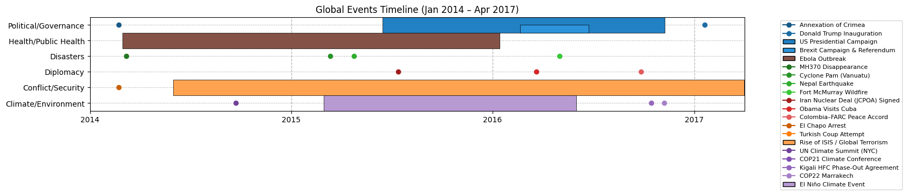
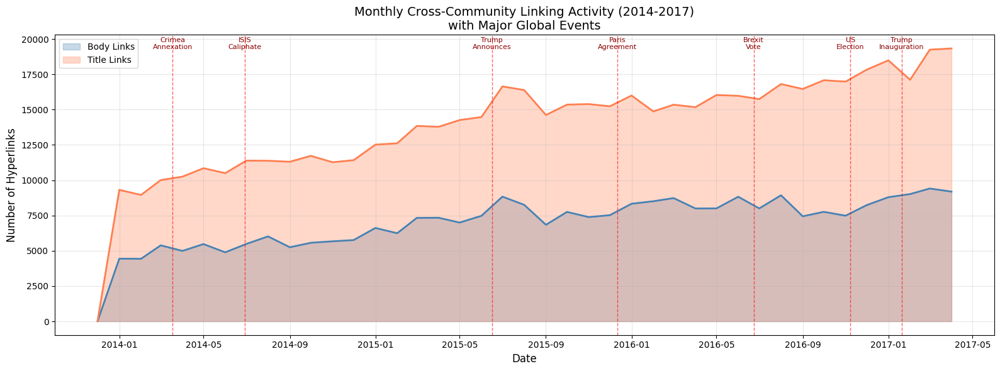

<!-- Leaflet -->
<link
  rel="stylesheet"
  href="https://unpkg.com/leaflet@1.9.4/dist/leaflet.css"
  integrity="sha256-p4NxAoJBhIIN+hmNHrzRCf9tD/miZyoHS5obTRR9BMY="
  crossorigin=""
/>

<!-- World polygons -->

  

    
EPFL Applied Data Analysis - Fall 2025

    <h1>The Reddit Event Network</h1>
    <h2>Does Information Really Flow Across Communities?</h2>

    

      <a class="button button-ghost" href="map.html">Explore the map</a>
      <a class="button button-ghost" href="https://github.com/epfl-ada/ada-2025-project-papayarules/blob/main/results.ipynb">Notebook</a>
    

    

      
      Click regions on the map to reveal the story
    

  

<section class="intro">
  <h2>The Question</h2>
  

    

      
Scroll through Reddit long enough and it feels inevitable: polarized debates are everywhere. One thread bleeds into the next, outrage spreads, and suddenly every community looks like part of the same argument.

      
But platforms don’t work by feeling. They work by structure. Reddit isn’t one crowd, it’s thousands of semi-isolated communities, each with its own borders. So we asked a more uncomfortable question: <strong>when event attention appears, does it actually travel?</strong>

      
We took that question literally. We tracked <strong>3 years of Reddit hyperlinks</strong> (2014–2017). Every link from one subreddit to another is a deliberate bridge, an attempt to pull context, attention, and narrative across a boundary. If polarization really spreads, those bridges should be everywhere.

      

        <strong>Spoiler: Barely.</strong> Reddit isn't a polarized warzone where sensitive content infects every corner. It's more like a <strong>quarantine ward</strong>.
      

    

    

      

        <h3>What We Looked At</h3>
        
<strong>Timeline:</strong> 2014–2017

        
<strong>Signal:</strong> Cross-subreddit hyperlinks

        
<strong>Goal:</strong> See if polarizing content actually jumps communities.

      

      

        <h3>What “Propagation” Means</h3>
        
We measure how often an event produces <strong>cross-community links</strong> (bridges) beyond its “home” subreddits.

        
Next: use the map to open an event and inspect its bridges.

      

    

  

</section>

<section class="data-overview">
  <h2>The Data</h2>

  

    

      858k
      Hyperlinks
    

    

      27k
      Subreddits
    

    

      18
      Global Events
    

  

  

    <figure style="margin: 0;">
      
      <figcaption>Timeline of major global events analyzed.</figcaption>
    </figure>
  

  

    <figure style="margin:0;">
      
      <figcaption>
        Monthly cross-community hyperlink volume (2014–2017).  
        Vertical markers indicate major global events.  
        Spikes align with shocks but most activity quickly recedes.
      </figcaption>
    </figure>
  

</section>

<section id="scrolly" class="scrolly">
  <!-- LEFT: sticky map area (now horizontal split: map top + media bottom) -->
  

    

      

        Interactive
        Global Event Map
      

      

        <button class="pill" id="btn-reset" type="button" title="Reset map view">Reset</button>
        <a class="pill pill-link" href="map.html" title="Open standalone explorer">Explorer</a>
      

    

    <!-- PATCH: horizontal split -->
    

      <!-- Top 2/3: map -->
      

        

      

    

  

  <!-- RIGHT: story OR event detail -->
  

    <!-- Default: Story rail (visible initially) -->
    

      

        

          
Narrative

          <h3 class="rail-title">What the map reveals</h3>
        

      

      

        <h4>The Core Finding</h4>
        
Event-related subreddits form tight clusters and rarely link out. Most of Reddit remains structurally insulated from debates.

        
Now click an event region on the map to see the evidence and examples.

      

      

  <h4>Which events actually propagate?</h4>

  

    
    
Click to enlarge

  

      <!-- Auto legend will be injected here -->

  <h4>Event categories</h4>
  

  

    Colors indicate the dominant event type.
  

   
      

        <article class="step passive">
          
Try this

          <h3>Click Crimea, then US Election</h3>
          
Notice how events stay trapped inside their related spaces.

        </article>

        <article class="step passive">
          
Then compare

          <h3>Click Ebola or Nepal</h3>
          
Disasters create brief cross-community bridges driven by solidarity.

        </article>

        <article class="step passive">
          
Interpretation

          <h3>Echo chamber ≠ total contamination</h3>
          
Reddit looks polarized if you focus on event-related subs, but the network structure shows quarantine from the mainstream.

        </article>
      

      

        <h4>What you can learn here</h4>
        <ul>
          <li>Which event types bridge communities</li>
          <li>Which events remain contained</li>
          <li>How geography relates to discussion clusters</li>
        </ul>
      

      

        
Open an event to see the deep-dive card.

      

    

    <!-- Event detail (hidden until user clicks an overlay) -->
    <aside id="event-rail" class="event-rail" aria-label="Event detail panel" hidden>
      <h2 class="event-title" id="event-title">Event title</h2>
      
Event description...

      <!-- Stats -->
      

      <!-- Media / figures (optional per event) -->
      

      <!-- Extra sections -->
      

      

        <a class="button" href="https://github.com/epfl-ada/ada-2025-project-papayarules/blob/main/results.ipynb">See methods in notebook</a>
      

    </aside>

  

</section>

<section class="conclusion">
  <h2>Conclusion: Rethinking Polarization</h2>
  
The conventional narrative says social media platforms push everyone toward extremes. Our data tells a different story:

  

    <strong>Reddit isn't becoming a single polarized warzone. It's becoming a collection of isolated villages.</strong>
  

  
Event-related communities are getting <em>denser</em> and more self-referential. But the vast majority of Reddit, the gaming, sports, cooking, and hobby communities, is essentially <strong>inoculated</strong> from this noise.

  <blockquote>
    <strong>Final thought:</strong> We may be overestimating polarization by focusing on the loud minority, while ignoring the massive, quiet ecosystem where people just talk about their hobbies.
  </blockquote>
</section>

  <a href="https://github.com/epfl-ada/ada-2025-project-papayarules/blob/main/results.ipynb" class="button">View the Jupyter Notebook</a>
  <a href="https://github.com/epfl-ada/ada-2025-project-papayarules" class="button">GitHub Repository</a>
  <a href="map.html" class="button">Open the Explorer</a>

  

    <em>EPFL Applied Data Analysis - Fall 2025</em>
  

<!-- Shared map code click-to-rail driver -->

